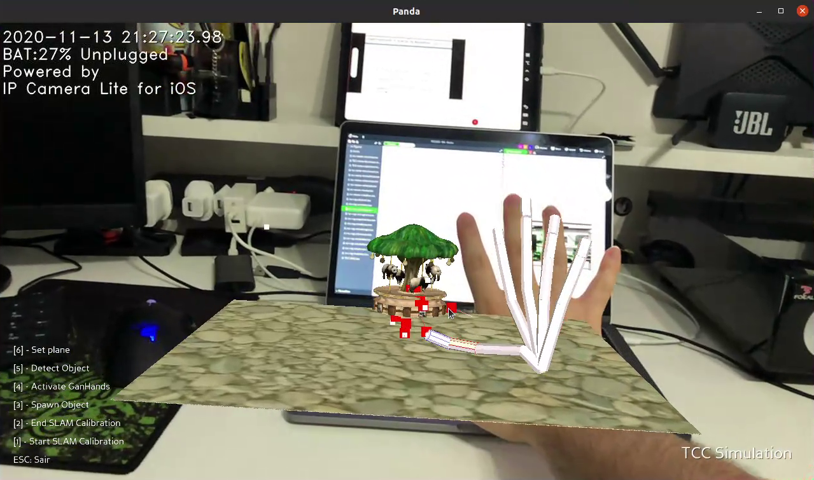
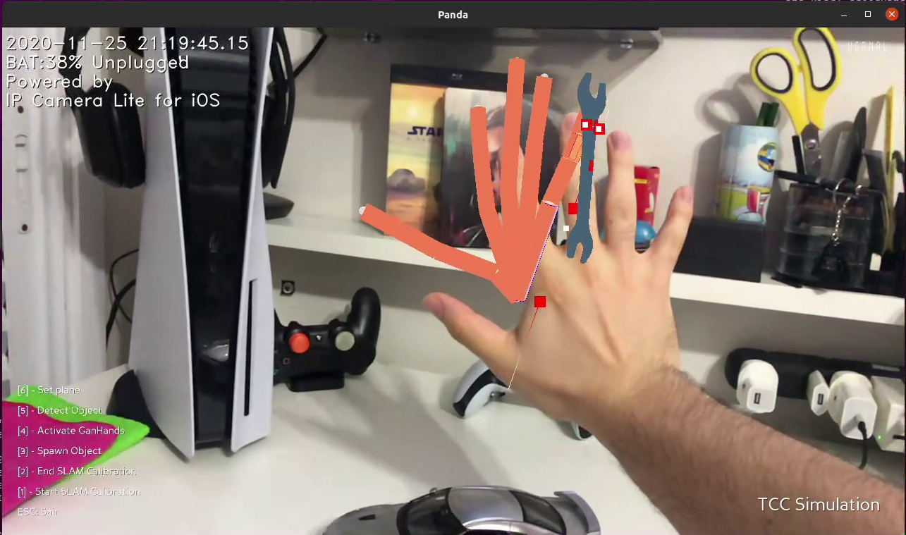
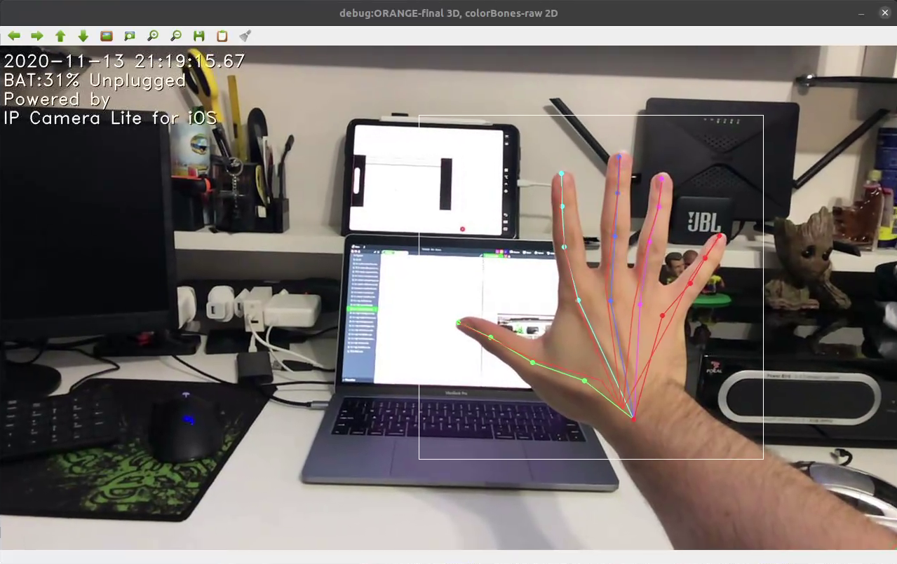
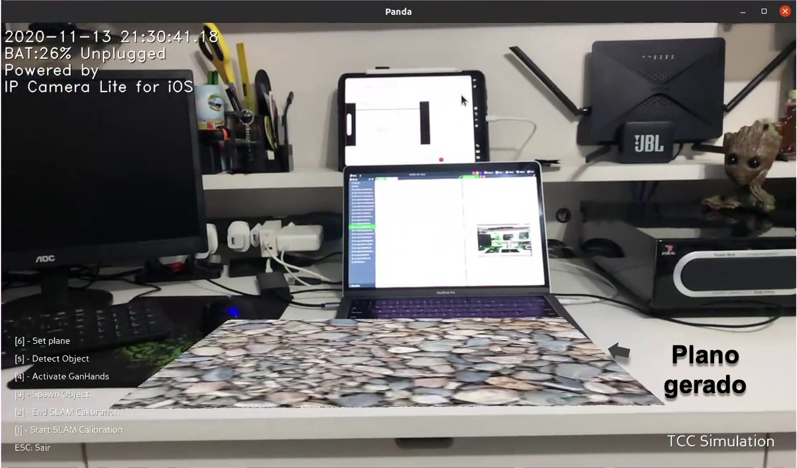
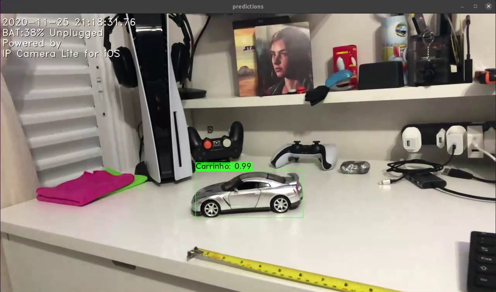

# GesturesAR
Final graduation project

This project requires the following repositories: https://github.com/EvertonCa/ORB_SLAM2 and https://github.com/EvertonCa/darknet.

You will need to ask for permission to use the framework GANHands.

# PROJECT ABSTRACT

Investments in Augmented Reality (AR) have grown considerably in recent years, reaching US$ 4.1 billions in 2019.  This advance is due to the increased use of AR in areas such as education, training, games and medicine.  In addition, technological advances in hardware enabled devices that, a few years ago, were unthinkable.  A popular example is Microsoft Hololens 2, which allows the user to use their own hands as a means of interacting with an ARexperience.  However, a disadvantage from this device is its high cost due to several sensors. Thus, this project offers an AR architecture that uses only a monocular RGB camera as a sensor,allowing the user to interact with an AR experience using their hands to perform gestures similar to the Microsoft Hololens 2 architecture, where it is possible to handle a virtual object in the same way that a real object would be manipulated.  The results obtained are promising, where the verification of the interaction of the hand with the virtual object worked in approximately 86.6% of the tests carried out, respecting the path defined by hand movement.

# WORKING PROJECT

Real hand interacting with a virtual object, placed above a virtual horizontal surface

Real hand interacting with a virtual object, placed relative to a real object in frame

Real hand being detected by GANHands

Horizontal plane created

YOLOv2 detecting the real object that will can used as reference to the virtual object

